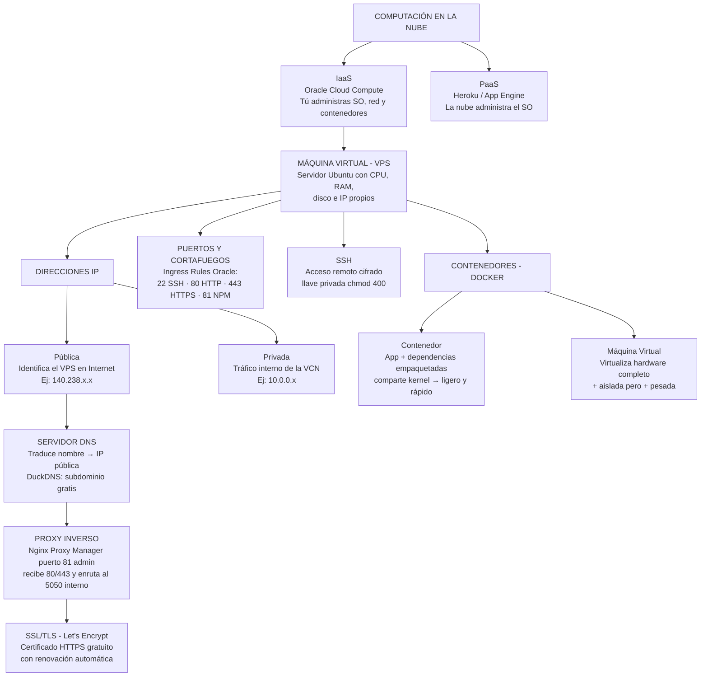

# SOLUCIÓN GUÍA DE APRENDIZAJE — IMPLANTACIÓN DEL SOFTWARE

**Programa:** Análisis y Desarrollo de Software (228118)
**Proyecto:** Desarrollo de soluciones de software inteligentes y sostenibles aplicando 4RI
**Fase:** Implantación | **Actividad:** Desplegar aplicaciones web y APIs en infraestructura Cloud con contenedores y certificados de seguridad
**Proyecto formativo desplegado:** `cristian_dokcker/proyecto1` (API Flask + MySQL + Nginx Proxy Manager)

---

## 3.1 ACTIVIDAD DE REFLEXIÓN INICIAL (Foro)

**Problemática:** *"En mi máquina funciona"* — la API falla en el servidor del cliente porque versiones de librerías, puertos y sistema operativo no coinciden.

### ¿Cómo evitamos que la infraestructura afecte el código?

1. **Empaquetar la aplicación en contenedores:** Docker encapsula código + librerías + runtime en una imagen inmutable; lo que corre local es idéntico a producción.
2. **Infraestructura como código:** `Dockerfile` y `docker-compose.yml` versionados en Git garantizan que todo el equipo levante entornos idénticos.
3. **Configuración por variables de entorno:** archivo `.env` separado del código (contraseñas, nombres de BD), nunca hardcodeado.
4. **Pipelines CI/CD:** este proyecto ya publica su imagen automáticamente a Docker Hub con GitHub Actions (`.github/workflows/deploy.yml`), evitando diferencias entre lo probado y lo desplegado.
5. **Simulacros de producción:** replicar el entorno antes de la entrega (verificado en `simulacro-produccion/`).

### ¿Qué ventajas ofrece empaquetar una aplicación antes de enviarla a internet?

| Ventaja | Explicación |
|---|---|
| Portabilidad | La imagen `samuelcr11/proyecto1-app:v1` corre igual en cualquier nube u on-premise |
| Aislamiento | API, MySQL y proxy viven en contenedores separados sin conflictos de librerías o puertos |
| Reproducibilidad | Misma versión de Python, Flask, PyMySQL y MySQL siempre — se elimina "en mi máquina funciona" |
| Escalabilidad | Réplicas del mismo contenedor con `docker compose up -d --scale` |
| Reversibilidad | Rollback instantáneo a la imagen anterior (`:v1`, `:latest`) si el despliegue falla |
| Seguridad | Solo se publican los puertos necesarios (80/443/81) e integración directa con SSL/TLS |

---

## 3.2 MAPA CONCEPTUAL — CONCEPTOS CLAVE DE DESPLIEGUE



**Relaciones clave:**
- La nube **IaaS** entrega un **VPS** con **IP pública**, protegido por un **cortafuegos** que solo abre los puertos necesarios.
- El administrador entra por **SSH** e instala **Docker** para ejecutar **contenedores** (más ligeros que VMs porque comparten el kernel del host).
- El **DNS** (DuckDNS) apunta el dominio a la IP pública; el **proxy inverso** recibe el tráfico HTTPS/443 y lo enruta al contenedor de la API en el puerto interno 5050.

---

## 3.3 TALLER PRÁCTICO GUIADO "DEL LOCAL A LA NUBE" — MANUAL TÉCNICO

> 📸 *En cada paso se indica dónde insertar la captura de pantalla exigida como evidencia.*

### Paso 1 — Creación de la instancia en Oracle Cloud

1. cloud.oracle.com → **Compute → Instances → Create Instance**.
2. Imagen: **Ubuntu 22.04/24.04**. Forma: *Always Free Eligible* (VM.Standard.E2.1.Micro o Ampere A1).
3. Networking: seleccionar/crear la **VCN**, **Subred Pública** y activar ✅ *Assign a public IPv4 address*.
4. Descargar la llave privada SSH (.key).

📸 *Captura: resumen de la instancia con su IP pública.*

### Paso 2 — Reglas de seguridad (Ingress Rules)

**Networking → Virtual Cloud Networks → [VCN] → Security Lists → Default Security List → Add Ingress Rules** (Source = 0.0.0.0/0):

| Puerto | Protocolo | Servicio |
|---|---|---|
| 80 | TCP | HTTP |
| 443 | TCP | HTTPS |
| 81 | TCP | Administración Nginx Proxy Manager |

📸 *Captura: Ingress Rules con los tres puertos habilitados.*

### Paso 3 — Conexión SSH

```bash
chmod 400 mi_llave.key                      # permisos correctos de la llave
ssh -i mi_llave.key ubuntu@<IP_PUBLICA>     # Linux/Mac/Git Bash o PowerShell
```

📸 *Captura: banner de bienvenida de Ubuntu en la terminal.*

### Paso 4 — Instalación de Docker y permisos

```bash
sudo apt update && sudo apt install -y docker.io docker-compose-v2
sudo usermod -aG docker ubuntu      # evita 'permission denied' en /var/run/docker.sock
newgrp docker                       # aplica el grupo sin reiniciar
docker --version && docker compose version
```

📸 *Captura: `docker --version` ejecutado SIN sudo.*

### Paso 5 — Transferencia y orquestación del proyecto1

```bash
mkdir ~/proyecto1 && cd ~/proyecto1
git clone https://github.com/<usuario>/proyecto1 .   # o subir archivos con scp:
# scp -i mi_llave.key docker-compose.yml .env ubuntu@<IP_PUBLICA>:~/proyecto1/

docker compose up -d        # levanta npm + app + db
docker compose ps           # verificar estado running/healthy
docker logs mi_app_python   # verificar conexión a MySQL
```

📸 *Captura: `docker compose ps` mostrando proxy-npm-082, mi_app_python y servidor-bd-082 activos.*

### Paso 6 — Gestión de dominio con DuckDNS

1. https://www.duckdns.org → iniciar sesión (GitHub/Google).
2. Crear subdominio: `proyecto1-cba.duckdns.org`.
3. Registrar la **IP pública** de Oracle → **update**.
4. Verificar desde el servidor: `ping proyecto1-cba.duckdns.org`.

📸 *Captura: panel DuckDNS con dominio e IP actualizada.*

### Paso 7 — Proxy inverso y certificado SSL

1. Acceder a `http://<IP_PUBLICA>:81` → credenciales iniciales `admin@example.com / changeme` (cambiarlas al entrar).
2. **Hosts → Proxy Hosts → Add Proxy Host**:
   - Domain Names: `proyecto1-cba.duckdns.org`
   - Scheme: `http` · Forward Hostname/IP: `mi_app_python` (nombre del contenedor) · Forward Port: `5050`
   - ✅ Block Common Exploits · ✅ Websockets Support
3. Pestaña **SSL**: *Request a new SSL Certificate* (Let's Encrypt) → aceptar términos → ✅ **Force SSL** → Save.
4. Probar en el navegador: `https://proyecto1-cba.duckdns.org` → la app responde con candado 🔒 y el mensaje *"Conexión exitosa a la base de datos"*.

📸 *Capturas: formulario Proxy Host, certificado emitido y navegador con HTTPS activo.*

### Paso 8 — Monitoreo y alertas con Uptime Kuma + Telegram

**8.1 Agregar el servicio al `docker-compose.yml`:**

```yaml
  uptime-kuma:
    image: louislam/uptime-kuma:1
    container_name: uptime-kuma
    restart: always
    ports:
      - "3001:3001"
    volumes:
      - uptime-kuma-data:/app/data
    networks:
      - red-interna     # misma red que la BD para monitorearla por nombre de contenedor
```

Y en `volumes:` agregar:

```yaml
  uptime-kuma-data:
    name: uptime-kuma-data
```

Desplegar solo el nuevo servicio:

```bash
docker compose up -d uptime-kuma
```

> 💡 Se conecta a `red-interna` para que el monitor TCP resuelva el servicio `db` por DNS interno de Docker.

**8.2 Habilitar el puerto 3001:**

1. **Oracle Cloud:** Ingress Rule → puerto **3001 TCP**, origen `0.0.0.0/0`.
2. **Servidor Ubuntu:**

```bash
sudo iptables -A INPUT -p tcp --dport 3001 -j ACCEPT
sudo apt-get update && sudo apt-get install -y iptables-persistent
sudo netfilter-persistent save
```

> ⚠️ Nota técnica: Docker publica sus puertos a través de sus propias cadenas (`DOCKER-USER`), por lo que la regla crítica es la **Ingress Rule de Oracle Cloud**; la regla de iptables se agrega para cumplir el procedimiento del taller.

**8.3 Crear el Bot de Telegram:**

1. En Telegram buscar **@BotFather** → `/newbot` → nombre `Alertas Servidor` y usuario terminado en `bot` (ej.: `alerta_mi_api_bot`) → **guardar el Bot Token**.
2. Buscar **@userinfobot** → `/start` → copiar el **Chat ID**.
3. **Obligatorio:** abrir el bot creado y presionar **Iniciar (/start)** para habilitar el envío de mensajes.

**8.4 Configuración inicial de Uptime Kuma:**

1. Navegador → `http://<IP_PUBLICA>:3001` → crear cuenta de administrador.
2. **Settings → Notifications → Setup Notification**:
   - Notification Type: `Telegram`
   - Friendly Name: `Bot Telegram`
   - Bot Token: pegar el token (sin espacios)
   - Chat ID: pegar el ID de usuario
   - Clic en **Test** (llega mensaje de prueba) → ✅ *Default enabled* → **Save**

**8.5 Crear los monitores (Add New Monitor):**

| Campo | Monitor 1 | Monitor 2 |
|---|---|---|
| Monitor Type | HTTP(s) | TCP Port |
| Friendly Name | API - Backend | MySQL Database |
| Hostname/URL | `https://proyecto1-cba.duckdns.org/` | `db` (servicio) o `servidor-bd-082` (contenedor) |
| Port | — | 3306 |
| Heartbeat Interval | 30 s | 30 s |

📸 *Capturas: servicio levantado, notificación Test en Telegram y dashboard con los 2 monitores en verde.*

---

## 3.4 RETO DE DESPLIEGUE DEL PROYECTO FORMATIVO (Transferencia)

El proyecto desplegado es **proyecto1**: aplicación Flask conectada a MySQL, con imagen publicada en Docker Hub vía CI/CD.

### Arquitectura final implementada

```
Internet ──HTTPS 443──► [NPM :80/:443/:81] ──red-proxy──► [mi_app_python :5050] ──red-interna──► [MySQL 8.0 :3306]
                          │ Let's Encrypt                    ▲ imagen samuelcr11/                    ▲ volumen db_data
                          └ Force SSL                    proyecto1-app:v1                        (persistencia)

Internet ──:3001──► [uptime-kuma] ──red-interna──► monitorea API (HTTP 30s) y MySQL (TCP 3306)
                      └ volumen uptime-kuma-data          └ alertas → Bot Telegram
```

### Archivos entregados

```
proyecto1/
├── docker-compose.yml   # Orquestación: npm + app + db (MODIFICADO según la guía)
├── Dockerfile           # python + flask + pymysql, EXPOSE 5050
├── sample_app.py        # API Flask: ruta / con prueba de conexión MySQL
├── requirements.txt     # flask, pymysql
├── .env                 # MYSQL_ROOT_PASSWORD, MYSQL_DATABASE (no subir a Git)
├── nginx/default.conf   # configuración previa del proxy simple (reemplazada por NPM)
└── .github/workflows/deploy.yml   # CI/CD: publica la imagen a Docker Hub
```

### Cambios aplicados al docker-compose.yml (cumplimiento de la guía)

| Antes | Después | Justificación |
|---|---|---|
| `nginx:alpine` manual con default.conf | `jc21/nginx-proxy-manager` con UI en :81 | La guía exige NPM como proxy inverso con SSL automatizado |
| App publicaba `5050:5050` al host | Solo `expose: 5050` | La API no debe ser accesible desde Internet; solo vía proxy |
| MySQL publicaba `5051:3306` | Sin puertos al host + healthcheck | La BD queda aislada de Internet (mínimo privilegio) |
| Una sola red `red-cba` | `red-proxy` (NPM↔API) y `red-interna` (API↔BD) | Segmentación de red por capas |
| Sin volúmenes de NPM ni healthcheck | `npm_data`, `npm_letsencrypt`, `db_data` + healthcheck | Persistencia de certificados/datos y arranque ordenado |

### Seguridad aplicada (rúbrica)

- ✅ **SSL/TLS:** certificado Let's Encrypt automático + Force SSL (80→443).
- ✅ **Puertos mínimos:** cortafuegos Oracle solo abre 22, 80, 443, 81; API y BD sin exposición directa.
- ✅ **Credenciales externas:** `.env` fuera del control de versiones.
- ✅ **Documentación:** este manual + compose declarativo versionable.

### Comandos de verificación final (lista de chequeo)

```bash
docker compose ps                          # 4 servicios Up (db healthy)
curl http://localhost/                     # HTML de la app vía NPM
curl http://localhost:3001                 # Uptime Kuma activo
openssl s_client -connect <dominio>:443    # certificado Let's Encrypt vigente
docker logs servidor-bd-082                # MySQL listo for connections
```

**Entregables rúbrica:** URL pública `https://proyecto1-cba.duckdns.org` *(completar tras ejecutar el taller)* + repositorio con `docker-compose.yml`.

---

## CONCLUSIÓN

La migración del proxy manual a Nginx Proxy Manager, el aislamiento de la base de datos y la publicación exclusiva de 80/443/81 convierten el proyecto1 en un despliegue seguro y reproducible. Los contenedores eliminan la inconsistencia entre entornos ("en mi máquina funciona") y el certificado Let's Encrypt garantiza cifrado HTTPS con renovación automática: competencias DevOps directamente demandadas por la industria del software.
